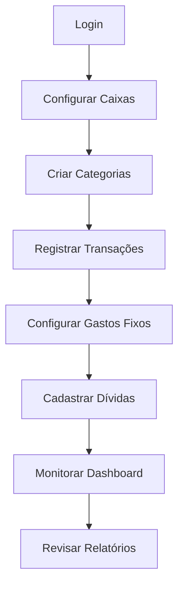

# 💰 Gerenciador Financeiro

<div align="center">


**Uma aplicação completa para controle financeiro pessoal**

[](https://reactjs.org/)
[](https://www.typescriptlang.org/)
[](https://firebase.google.com/)
[](https://vercel.com/)

</div>

---

## 📋 Índice

- [🎯 Sobre o Projeto](#-sobre-o-projeto)
- [✨ Funcionalidades](#-funcionalidades)
- [🚀 Como Usar](#-como-usar)
- [🛠️ Instalação](#️-instalação)
- [📱 Interface](#-interface)
- [🔧 Configuração](#-configuração)
- [📊 Dicas de Uso](#-dicas-de-uso)
- [🤝 Contribuição](#-contribuição)

---

## 🎯 Sobre o Projeto

O **Gerenciador Financeiro** é uma aplicação web moderna e intuitiva desenvolvida para ajudar você a controlar suas finanças pessoais de forma eficiente. Com interface responsiva e funcionalidades completas, você pode gerenciar receitas, despesas, dívidas, cartões de crédito e muito mais.

### 🎨 Design Original
Baseado no design do [Figma](https://www.figma.com/design/4TMzPboPPIyWPcFCF6prck/Gerenciador-Financeiro), este projeto traz uma experiência visual moderna e funcional.

---

## ✨ Funcionalidades

### 🏠 **Dashboard**
- 📈 Visão geral das finanças
- 📊 Gráficos de receitas e despesas
- 🎯 Metas financeiras
- 📅 Filtros por mês/ano
- 💡 Cards informativos com totais

### 💳 **Caixas (Contas)**
- 🏦 Gerenciamento de múltiplas contas
- 💰 Conta Corrente, Poupança, Carteira
- 📈 Controle de saldos
- 🔄 Transferências entre contas
- 📊 Histórico de movimentações

### 💸 **Transações**
- ➕ Adicionar receitas e despesas
- 📅 Controle por data
- 🏷️ Categorização automática
- 🔍 Filtros avançados
- 📱 Interface responsiva

### 🔄 **Gastos Fixos**
- 📅 Controle de despesas recorrentes
- ✅ Marcação de pagamentos
- 🏷️ Categorização personalizada
- 📊 Relatórios mensais
- 🔗 Integração com dívidas

### 💳 **Cartões de Crédito**
- 💳 Cadastro de cartões
- 🛒 Controle de compras parceladas
- 📅 Gestão de faturas
- 💰 Consolidação automática
- 📊 Acompanhamento de limites

### 📋 **Dívidas**
- 📝 Cadastro de dívidas parceladas
- 📅 Controle de vencimentos
- ✅ Acompanhamento de pagamentos
- 🏷️ Categorização personalizada
- 🔄 Modo "Dívida Existente" (para dívidas já em andamento)

### 🏷️ **Categorias**
- ➕ Criação de categorias personalizadas
- ✏️ Edição e exclusão
- 🎨 Organização visual
- 📊 Relatórios por categoria

---

## 🚀 Como Usar

### 🎯 **Primeiros Passos**

1. **Acesse a aplicação** através do link de deploy
2. **Faça login** com sua conta Google
3. **Configure suas contas** na aba "Caixas"
4. **Adicione suas categorias** personalizadas
5. **Comece a registrar** suas transações

### 📊 **Fluxo de Uso Recomendado**



### 💡 **Dicas Importantes**

- **Configure suas contas primeiro** para ter controle total dos saldos
- **Use categorias** para melhor organização dos gastos
- **Marque gastos fixos como pagos** para controle preciso
- **Monitore o dashboard** regularmente para acompanhar sua evolução
- **Use o modo "Dívida Existente"** para dívidas já em andamento

---

## 🛠️ Instalação

### 📋 **Pré-requisitos**

- Node.js 18+ 
- npm ou yarn
- Conta Firebase
- Conta Google (para autenticação)

### 🔧 **Passos para Instalação**

1. **Clone o repositório**
   ```bash
   git clone https://github.com/maxgsandre/GERENCIADOR-FINANCEIRO.git
   cd GERENCIADOR-FINANCEIRO
   ```

2. **Instale as dependências**
   ```bash
   npm install
   ```

3. **Configure o Firebase**
   - Crie um projeto no [Firebase Console](https://console.firebase.google.com/)
   - Configure Authentication com Google
   - Configure Firestore Database
   - Copie as credenciais para `.env.local`

4. **Configure as variáveis de ambiente**
   ```bash
   cp .env.example .env.local
   # Edite o arquivo .env.local com suas credenciais
   ```

5. **Execute o projeto**
   ```bash
   npm run dev
   ```

6. **Acesse no navegador**
   ```
   http://localhost:5173
   ```

---

## 📱 Interface

### 🎨 **Design System**

- **Tema**: Suporte a modo claro e escuro
- **Responsivo**: Funciona em desktop, tablet e mobile
- **Acessibilidade**: Interface intuitiva e fácil de usar
- **Performance**: Carregamento rápido e fluido

### 🖥️ **Layout**

- **Sidebar**: Navegação principal
- **Header**: Informações do usuário e tema
- **Main Content**: Área principal de cada funcionalidade
- **Modals**: Formulários e confirmações

---

## 🔧 Configuração

### 🔐 **Firebase Setup**

1. **Criar Projeto Firebase**
   ```bash
   # No Firebase Console
   - Criar novo projeto
   - Habilitar Authentication (Google)
   - Habilitar Firestore Database
   ```

2. **Configurar Regras de Segurança**
   ```javascript
   // Firestore Rules
   rules_version = '2';
   service cloud.firestore {
     match /databases/{database}/documents {
       match /users/{userId}/{document=**} {
         allow read, write: if request.auth != null && request.auth.uid == userId;
       }
     }
   }
   ```

3. **Variáveis de Ambiente**
   ```env
   VITE_FIREBASE_API_KEY=sua_api_key
   VITE_FIREBASE_AUTH_DOMAIN=seu_projeto.firebaseapp.com
   VITE_FIREBASE_PROJECT_ID=seu_projeto_id
   VITE_FIREBASE_STORAGE_BUCKET=seu_projeto.appspot.com
   VITE_FIREBASE_MESSAGING_SENDER_ID=seu_sender_id
   VITE_FIREBASE_APP_ID=seu_app_id
   ```

### 🚀 **Deploy**

**Vercel (Recomendado)**
```bash
# Instalar Vercel CLI
npm i -g vercel

# Deploy
vercel

# Configurar variáveis de ambiente no painel Vercel
```

---

## 📊 Dicas de Uso

### 💰 **Gestão Financeira Eficiente**

1. **Configure todas as suas contas** para ter visão completa
2. **Use categorias específicas** (ex: "Supermercado", "Transporte")
3. **Registre transações diariamente** para manter controle
4. **Configure gastos fixos** para automação
5. **Monitore o dashboard** semanalmente

### 📅 **Organização Mensal**

1. **Início do mês**: Configure receitas previstas
2. **Durante o mês**: Registre todas as transações
3. **Fim do mês**: Revise gastos e ajuste orçamento
4. **Análise**: Use relatórios para melhorar controle

### 🎯 **Metas Financeiras**

- **Economia**: Defina metas mensais de poupança
- **Dívidas**: Acompanhe redução de dívidas
- **Investimentos**: Monitore crescimento de investimentos
- **Gastos**: Controle limites por categoria

---

## 🤝 Contribuição

### 🔧 **Como Contribuir**

1. **Fork** o projeto
2. **Crie uma branch** para sua feature (`git checkout -b feature/AmazingFeature`)
3. **Commit** suas mudanças (`git commit -m 'Add some AmazingFeature'`)
4. **Push** para a branch (`git push origin feature/AmazingFeature`)
5. **Abra um Pull Request**

### 📝 **Padrões de Código**

- **TypeScript**: Use tipagem forte
- **ESLint**: Siga as regras de linting
- **Prettier**: Formatação consistente
- **Commits**: Use conventional commits
- **Testes**: Adicione testes para novas funcionalidades

### 🐛 **Reportar Bugs**

Use o [GitHub Issues](https://github.com/maxgsandre/GERENCIADOR-FINANCEIRO/issues) para reportar bugs ou sugerir melhorias.

---

## 📄 Licença

Este projeto está sob a licença MIT. Veja o arquivo [LICENSE](LICENSE) para mais detalhes.

---

## 👨‍💻 Autor

**Maxgsandre**
- GitHub: [@maxgsandre](https://github.com/maxgsandre)
- LinkedIn: [Maxgsandre](https://linkedin.com/in/maxgsandre)

---

## 🙏 Agradecimentos

- **Figma**: Design original do projeto
- **React**: Framework principal
- **Firebase**: Backend e autenticação
- **Vercel**: Deploy e hospedagem
- **Comunidade**: Contribuições e feedback

---

<div align="center">

**⭐ Se este projeto te ajudou, considere dar uma estrela! ⭐**

[](https://github.com/maxgsandre/GERENCIADOR-FINANCEIRO/stargazers)

</div>